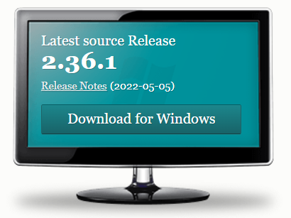

## INSTALL

***
 
 

You must use *[this link](https://git-scm.com/downloads)* if you want to install GIT on our computer. It's quite simple, use the "next" button until the program installs.

 
If you find it difficult, you can use the official documentation at *[this link](https://git-scm.com/doc)*

 

