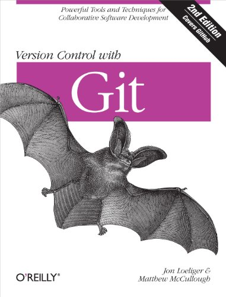

## Interesting

*Here's an interesting book as a bonus!*

***

 

### Version Control with Git: Powerful tools and techniques for collaborative software development 2nd Edition, Kindle Edition

_Get up to speed on Git for tracking, branching, merging, and managing code revisions. Through a series of step-by-step tutorials, this practical guide takes you quickly from Git fundamentals to advanced techniques, and provides friendly yet rigorous advice for navigating the many functions of this open source version control system._

Please don't use Markdown tables it's terrible :D
| Таблицы       | Это                | Круто |
| ------------- |:------------------:| -----:|
| столбец 3     | align right    | $1600 |
| столбец 2     | align center |   $12 |
| зебра-строки  | cool         |    $1 |

